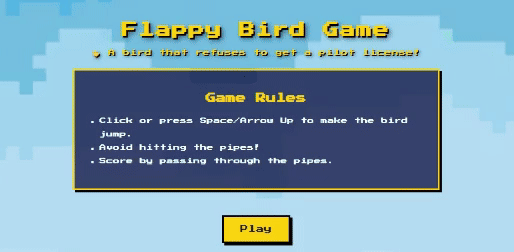

I talk to my computer more than to humans—unfortunately, it talks back only in errors.  
Code, novels and games—that’s pretty much me.
Some nights I’m fixing bugs, other nights I’m reading comics/novels or getting destroyed in boss fights. Sometimes I even make my own games.
Oh and yes… I made a bird that refuses to fly properly :(

  <b>(click on the image)</b>

